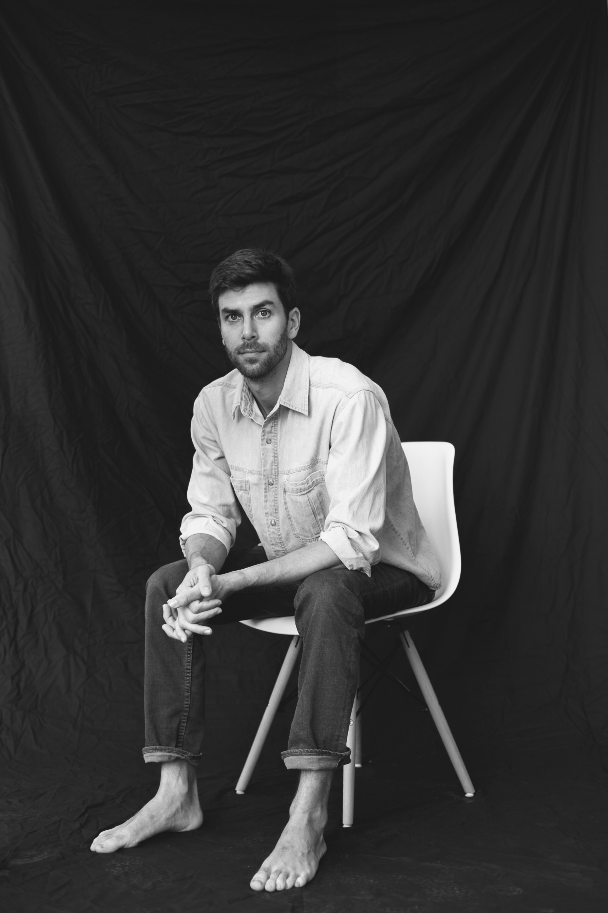

---
project:
  type: website

format:
  html:
    page-layout: full
    anchor-sections: false
    link-external-newwindow: true

lightbox: true
---

:::::::: columns
::: {.column width="5%"}
<!-- spacer -->
:::

::: {.column width="30%"}
<!--  -->

{.img-desktop} 
{.img-mobile} 
<h4>Photo: [Cristina Carrizosa](https://www.cristinacarrizosa.com)</h4>
:::

::: {.column width="5%"}
<!-- spacer -->
:::

::: {.column width="50%"}
## ABOUT

Hello! I’m an interdisciplinary scientist dedicated to environmental sustainability and social justice, particularly in Amazonia. My professional and academic work focus on Indigenous peoples’ rights, natural resource management, and biocultural conservation.   I’ve worked across academia, philanthropy, and the nonprofit sector to support Indigenous stewardship and equitable conservation. As a Program Fellow with the [Andes-Amazon Initiative](https://www.moore.org/initiative-strategy-detail?initiativeId=andes-amazon-initiative) at the Gordon and Betty Moore Foundation, I developed grants advancing land tenure and conservation across five Amazonian countries and developed monitoring systems to guide strategic decision-making. At Princeton University’s [High Meadows Environmental Institute](https://environment.princeton.edu/), I partnered with Cofán, Siekopai, and Siona communities to research Indigenous governance and ecological resilience. Earlier in my career, I supported community-based conservation in Melanesia through my work at the American Museum of Natural History’s 
[Center for Biodiversity and Conservation](https://www.amnh.org/research/center-for-biodiversity-conservation). Want more details? See a brief <a href="/resume/resume.html" target="_blank">resume</a>.
:::

::: {.column width="10%"}
<!-- spacer -->
:::
::::::::

