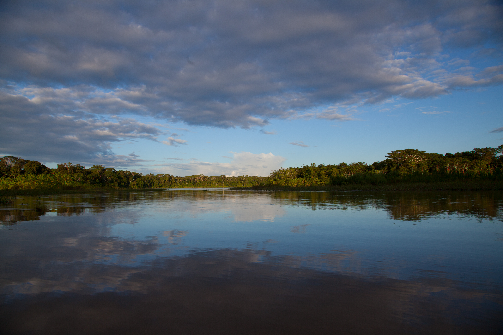

```{=html}
<div class="photo-page">
```

:::::: columns

::: {.column width="12.5%"}
:::

::: {.column width="25%"}
```{=html}
<a href="photo-amazonia.qmd" class="hover-card" tabindex="0">
  Amazonia
  <span class="preview">
    
  </span>
</a>
```
:::
::: {.column width="25%"}
```{=html}
<a href="photo-melanesia.qmd" class="hover-card" tabindex="0">
  Melanesia
  <span class="preview">
    
  </span>
</a>
```
:::
::: {.column width="25%"}
```{=html}
<a href="photo-africa.qmd" class="hover-card" tabindex="0">
  Africa
  <span class="preview">
    
  </span>
</a>
```
:::

:::::::: columns
::: {.column width="12.5%"}

::::::

:::::::::

```{=html}
</div>
```


<style>

/* hide title block but keep browser tab title */
.quarto-title-block {
  display: none !important;
}

/* center container vertically & horizontally */
.photo-page .columns {
  text-align: center;
}

.photo-page .column {
  margin-top: 15%;
  font-size: 1.5rem;
  font-family: 'Source Sans Pro', sans-serif;
  font-weight: 400;
  color: #444;
}

.photo-page .hover-card {
  position: relative;
  cursor: pointer;
  padding: 0 .2rem;
  outline: none;
  text-decoration: none;
  color: inherit;
  transition: all 0.2s ease;
  display: inline-block;
}

.photo-page .hover-card:hover {
  text-decoration: underline;
  text-decoration-thickness: 2px;
  text-underline-offset: 3px;
  color: inherit;
}

.photo-page .hover-card .preview {
  position: absolute;
  left: 50%;
  top: 100%;
  transform: translate(-50%, 2rem);
  opacity: 0;
  visibility: hidden;
  transition: opacity .3s ease, visibility .3s ease;
  pointer-events: none;
  z-index: 1000;
}

.photo-page .hover-card .preview img {
  display: block;
  width: 400px;
  height: auto;
  border-radius: 8px;
  box-shadow: 0 10px 30px rgba(0, 0, 0, 0.3);
}

.photo-page .hover-card:hover .preview,
.photo-page .hover-card:focus-within .preview {
  opacity: 1;
  visibility: visible;
}

/* Ensure footer maintains normal styling */
.nav-footer {
  font-weight: inherit !important;
}

.nav-footer a {
  font-weight: inherit !important;
}

/* Mobile styles */
@media (max-width: 768px) {
  .photo-page .columns {
    display: block !important;
  }
  
  .photo-page .column {
    width: 100% !important;
    text-align: center;
  }
  
  .photo-page .hover-card {
    display: block;
    text-decoration: none;
  }
  
  .photo-page .hover-card:hover {
    text-decoration: none;
  }
  
  .photo-page .hover-card .preview {
    display: none !important;
  }
}

</style>
